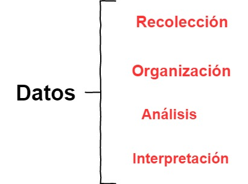
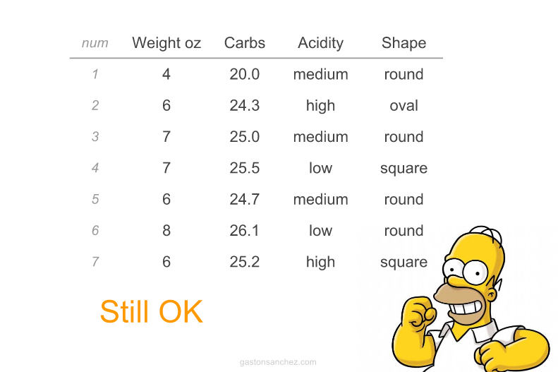

## Definición

<q>
La estadística es el estudio de la colección, análisis, interpretación, presentación y organizacón de los datos.
</q>

--- 

## Estadística 

```{r, echo=FALSE,fig.align='center'}
      
```

---

## Fuente de datos en Microbiología..

```{r, echo=FALSE,fig.align='center'}
      knitr::include_graphics('./figure/Escala.png')
```

---

## Datos 
<span style="display:block; height: 2cm;"></span>

En estadística, 'los datos' se conceptualizan como un conjunto de  <span style="color:#FF4000">objetos</span> sobre los cuales medimos u observamos una o más <span style="color:#DF0101">características </span>. 


```{r, echo=FALSE,fig.align='center'}
      knitr::include_graphics('./figure/data2.jpg')
```

--- 

## Variable

<span style="display:block; height: 2cm;"></span>

<q> Una característica o atributo que puede  <span style="color:#FF4000">variar</span>  de un individuo a otro. </q>

---

## Variable
<span style="display:block; height: 2cm;"></span>
<style>
  <slide class="{{ slide.class }}" id="{{ slide.id }}">
    <hgroup>
    {{{ slide.header }}}
  </hgroup>
    <article>
    <hr noshade size=4 color='red'>  
    {{{ slide.content }}}  
    <div class='left' style='float:left;width:48%'>
    {{{ slide.left.html }}}
    </div>    
      <div class='right' style='float:right;width:48%'>
      {{{ slide.right.html }}}
      </div>
        </article>
        </slide>
</style>
        
        
*** {name: left}

- <span style="color:orange">Inviduo </span>
- Observación
- sujeto
- objeto
- caso
- **Unidad experimental**

*** {name: right}
- <span style="color:orange">Variables </span>
- Característica
- Atributo
- Rasgo

--- 

## Variables 

<q>  Las <span style="color:red"> variables</span> juegan un papel protagónico en la estadística y diseño de experimentos </q>

--- 

## Variables 

```{r, echo=FALSE,fig.align='center'}
      knitr::include_graphics('./figure/flujo.jpg')
```

--- 

## Variables 

```{r, echo=FALSE,fig.align='center'}
      knitr::include_graphics('./figure/Var.jpg')
```

---

## Variables

<q> Nuestro turno: ejemplo de variables típicas en microbiología.....</q>

--- 

## Variables 

<q>¿Cómo convertiríamos una variable _cuantitativa_ en una _cualitativa_ o viceversa? </q>

---


## Caso 1: Unas cuantas manzanas.... 

<span style="display:block; height: 2cm;"></span>

```{r, echo=FALSE,fig.align='center'}
      knitr::include_graphics('./figure/1.png')
```

--- 

## Caso 1: Unas cuantas manzanas.... 


```{r, echo=FALSE,fig.align='center'}
      knitr::include_graphics('./figure/2.png')
```

--- 


## Caso 2: Más manzanas.... 


```{r, echo=FALSE,fig.align='center'}
      knitr::include_graphics('./figure/3.png')
```

--- 


## Caso 2: Más manzanas.... 


```{r, echo=FALSE,fig.align='center'}
      
```

--- 

## Caso 3: Muchas más manzanas.... 


```{r, echo=FALSE,fig.align='center'}
      knitr::include_graphics('./figure/5.png')
```

--- 

## Caso 3: Muchas más manzanas.... 


```{r, echo=FALSE,fig.align='center'}
      knitr::include_graphics('./figure/6.png')
```

--- 


## Resumiendo variables...

<span style="display:block; height: 2cm;"></span>

>1. Tablas de frecuencia

>2. Gráficos

>3. Resumenes numéricos 

--- 

## Resumiendo variables: Tablas de frecuencia

```{r, echo=FALSE,fig.align='center'}
      knitr::include_graphics('./figure/fre.png')
```

---

## Resumiendo variables: Tablas de frecuencia

| Acidity | Conteo |
|:-------:|:------:|
|Low      |        |
|Medium     |        |
|High         |        |

---


## Resumiendo variables

<span style="display:block; height: 2cm;"></span>

```{r, echo=FALSE,fig.align='center'}
      knitr::include_graphics('./figure/flujoMed.jpg')
```

---

## Medidas de tendencia central 

<span style="display:block; height: 2cm;"></span>

- Media: Promedio

- Mediana: Punto medio o central 

- Moda: Más común o frecuente

--- 

## Media 

$$\bar x = \frac{1}{n}\sum_{i = 1}^{n} x_i$$


```{r, echo=FALSE,fig.align='center'}
      knitr::include_graphics('./figure/media.png')
```

---

## Mediana

Es el punto medio o central de una distribución ordenada de valores. 


```{r, echo=FALSE,fig.align='center'}
      knitr::include_graphics('./figure/mediana.png')
```

```{r, echo=FALSE,fig.align='center'}
      knitr::include_graphics('./figure/mediana2.png')
```

---


## Variables categóricas: Representación gráfica
### Gráfico de tortas
```{r, echo=FALSE,warning=FALSE,message=FALSE,fig.align='center'}
library(ggpubr)
df <- data.frame(
 group = c("Male", "Female", "Child"),
  value = c(25, 25, 50))
labs <- paste0(df$group, " (", df$value, "%)")
ggpie(df, "value", label = labs,
   fill = "group", color = "white",
   palette = c("#00AFBB", "#E7B800", "#FC4E07"))

```

---

## Variables categóricas: Representación gráfica
### Gráfico de barras
```{r, echo=FALSE,warning=FALSE,message=FALSE,fig.align='center'}
library(ggpubr)
df <- data.frame(dose=c("D0.5", "D1", "D2"),
   len=c(4.2, 10, 29.5))

# Basic plot with label outsite
# +++++++++++++++++++++++++++
ggbarplot(df, x = "dose", y = "len",
  label = F, label.pos = "out")

```

---

## Exploración gráfica 


> - **Exploración**: Comprobar si en los datos hay valores inusuales, asegurarse de     cumplir los suspuestos requeridos por el anáisis seleccionados y, en ocasiones, ayudarnos a decidir que tipo de análisis llevar a cabo. 
 
> - **Análisis**: Evaluación de hipótesis

> - **Presentación y comunicación de resultados**

---

## Histogramas 

```{r, echo=FALSE,warning=FALSE,message=FALSE,}
library(ggpubr)
# Create some data format
set.seed(1234)
wdata = data.frame(
   sex = factor(rep(c("F", "M"), each=200)),
   weight = c(rnorm(200, 55), rnorm(200, 58)))
# Combine histogram and density plots
gghistogram(wdata, x = "weight",
   add = "mean", rug = TRUE,
   fill = "sex", palette = c("pink", "blue"),
   add_density = TRUE)

```

---

## Dot plots o gráficos de puntos


```{r, echo=FALSE,warning=FALSE,message=FALSE,}
library(ggpubr)
# Load data
data("ToothGrowth")
df <- ToothGrowth

# Basic plot with summary statistics : mean_sd
# +++++++++++++++++++++++++++
ggdotplot(df, x = "dose", y = "len",
   add = "mean_sd",color='blue')

```

---

## Boxplot o Cajas y bigotes

```{r, echo=FALSE,fig.align='center'}
      knitr::include_graphics('./figure/boxplot2.png')
```

---

## Boxplot o Cajas y bigotes


```{r, echo=FALSE,warning=FALSE,message=FALSE,fig.align='center'}
library(ggpubr)
# Load data
data("ToothGrowth")
df <- ToothGrowth

data("ToothGrowth")
df <- ToothGrowth

# Basic plot
# +++++++++++++++++++++++++++
# width: change box plots width
ggboxplot(df, x = "dose", y = "len", width = 0.8)


```

---

##  Boxplot o Cajas y bigotes

```{r, echo=FALSE,warning=FALSE,message=FALSE,fig.align='center'}
library(ggpubr)
# Load data
data("ToothGrowth")
df <- ToothGrowth

# Add jitter points and change the shape by groups
ggboxplot(df, x = "dose", y = "len",
   add = "jitter", shape = "dose")


```

---

## Scatterplot o Gr?fico de dispersi?n 


```{r, echo=FALSE,warning=FALSE,message=FALSE, fig.align='center'}
# Load data
data("mtcars")
df <- mtcars
df$cyl <- as.factor(df$cyl)


# Basic plot
# +++++++++++++++++++++++++++
ggscatter(df, x = "wt", y = "mpg",
   color = "black", shape = 21, size = 3, # Points color, shape and size
   add = "reg.line",  # Add regressin line
   add.params = list(color = "blue", fill = "lightgray"), # Customize reg. line
   conf.int = TRUE, # Add confidence interval
   cor.coef = TRUE # Add correlation coefficient
   )
```

---