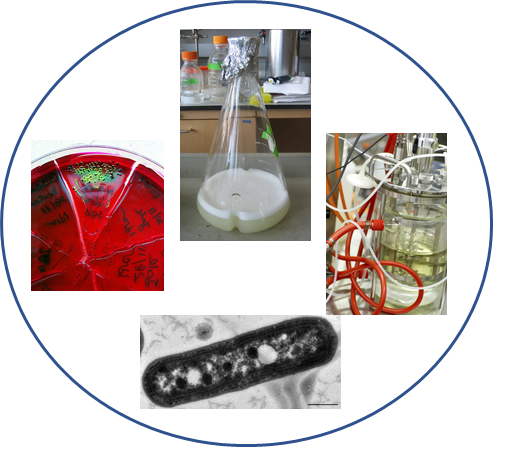
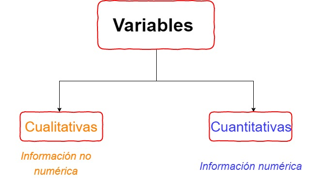
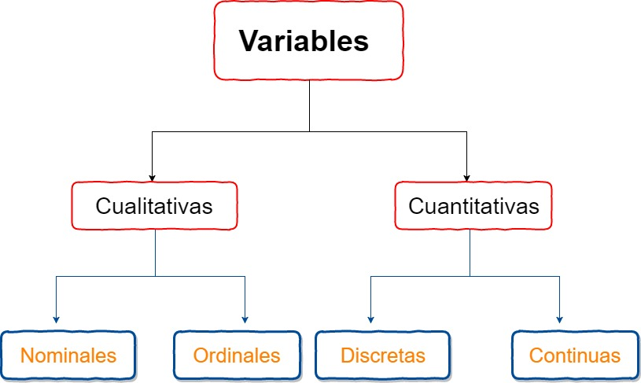
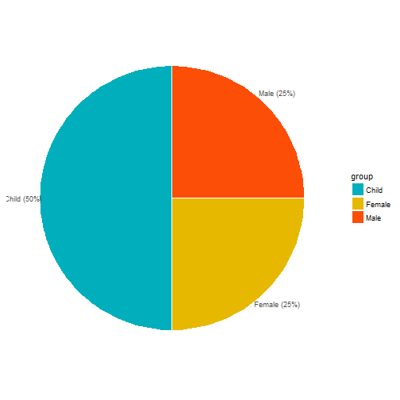

## Definición

<q>
La estadística es el estudio de la colección, análisis, interpretación, presentación y organizacón de los datos.
</q>

--- 

## Estadística 

---

## Fuente de datos en Microbiología..

---

## Datos 

En estadística, 'los datos' se conceptualizan como un conjunto de  objetos sobre los cuales medimos u observamos una o más características . 

--- 

## Variable

<q> Una característica o atributo que puede  variar  de un individuo a otro. </q>

---

## Variable

        
        
*** {name: left}

- Inviduo 
- Observación
- sujeto
- objeto
- caso
- **Unidad experimental**

*** {name: right}
- Variables 
- Característica
- Atributo
- Rasgo

--- 

## Variables 

<q>  Las  variables juegan un papel protagónico en la estadística y diseño de experimentos </q>

--- 

## Variables 

--- 

## Variables 

---

## Variables

<q> Nuestro turno: ejemplo de variables típicas en microbiología.....</q>

--- 

## Variables 

<q>¿Cómo convertiríamos una variable _cuantitativa_ en una _cualitativa_ o viceversa? </q>

---

## Caso 1: Unas cuantas manzanas.... 

--- 

## Caso 1: Unas cuantas manzanas.... 

--- 

## Caso 2: Más manzanas.... 

--- 

## Caso 2: Más manzanas.... 

--- 

## Caso 3: Muchas más manzanas.... 

--- 

## Caso 3: Muchas más manzanas.... 

--- 

## Resumiendo variables...

>1. Tablas de frecuencia

>2. Gráficos

>3. Resumenes numéricos 

--- 

## Resumiendo variables: Tablas de frecuencia

---

## Resumiendo variables: Tablas de frecuencia

| Acidity | Conteo |
|:-------:|:------:|
|Low      |        |
|Medium     |        |
|High         |        |

---

## Resumiendo variables

---

## Medidas de tendencia central 

- Media: Promedio

- Mediana: Punto medio o central 

- Moda: Más común o frecuente

--- 

## Media 

$$\bar x = \frac{1}{n}\sum_{i = 1}^{n} x_i$$

---

## Mediana

Es el punto medio o central de una distribución ordenada de valores. 

---

## Variables categóricas: Representación gráfica
### Gráfico de tortas

---

## Variables categóricas: Representación gráfica
### Gráfico de barras

---
